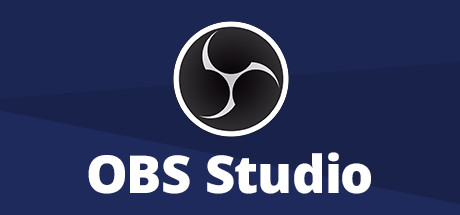

# Configuración de OBS para PC de Bajos Recursos y Gama Alta

## ¿Qué es OBS Studio?

**OBS Studio** es una potente aplicación de código abierto que te permite capturar, grabar y transmitir contenido de tu pantalla. Ya sea que estés creando contenido para transmisiones en vivo, tutoriales o simplemente deseas grabar tus sesiones de juego, OBS Studio es una herramienta versátil y altamente configurable que se adapta a tus necesidades.

OBS Studio se destaca por su gran comunidad de usuarios que están siempre dispuestos a ayudar y resolver problemas, lo que hace que sea una gran herramienta hasta el momento.

**Sitio web para descargar OBS Studio:** [Sitio web de OBS Studio](https://obsproject.com)

**Foro de OBS Studio:** [Foro de OBS Studio](https://obsproject.com/forum/)

**Repositorio de OBS Studio en GitHub:** [Repositorio de OBS Studio en GitHub](https://github.com/obsproject/obs-studio)

**Pasos para configurar OBS para PC de bajos recursos:**

1. Abre OBS Studio.
2. En la pestaña **Salida**, selecciona **x264** como códec de video.
3. En la pestaña **Video**, establece la resolución en **1280 x 720 píxeles**.
4. En la pestaña **Calidad de video**, selecciona **ultrafast** como modo de codificación.
5. En la pestaña **Tasa de bits**, establece la tasa de bits en **2500 kbps**.

**Consejos para mejorar el rendimiento en PC de bajos recursos:**

- Cierra todas las demás aplicaciones que no estés usando.
- Deshabilita los efectos visuales en el sistema operativo.
- Actualiza los controladores de la tarjeta gráfica.
- Considera reducir la resolución de tu monitor durante la grabación si experimentas problemas de rendimiento.

**Atajos recomendados:**

- Iniciar/Detener grabación: **Ctrl + Alt + R**
- Iniciar/Detener transmisión: **Ctrl + Alt + T**
- Cambiar escena: **Ctrl + Tab**
- Agregar escena: **Ctrl + Shift + N**
- Eliminar escena: **Ctrl + Shift + Supr**

## Configuración óptima para PC de gama alta

**Pasos para configurar OBS para PC de gama alta:**

1. Abre OBS Studio.
2. En la pestaña **Salida**, selecciona **H.265 (HEVC)** como códec de video.
3. En la pestaña **Video**, establece la resolución en **1080p o superior**.
4. En la pestaña **Calidad de video**, selecciona **veryfast** o **faster** como modo de codificación.
5. En la pestaña **Tasa de bits**, establece la tasa de bits en **10.000 kbps o más**.

**Consejos para mejorar la calidad en PC de gama alta:**

- Usa una tarjeta gráfica dedicada de alta gama.
- Asegúrate de que tu PC tenga suficiente RAM.
- Graba en un disco duro SSD de alta velocidad.
- Considera invertir en un micrófono de calidad para mejorar el audio de tus grabaciones.
- Configura atajos de teclado personalizados para un flujo de trabajo más eficiente.

**Atajos recomendados:**

- Iniciar/Detener grabación: **Ctrl + Alt + R**
- Iniciar/Detener transmisión: **Ctrl + Alt + T**
- Cambiar escena: **Ctrl + Tab**
- Agregar escena: **Ctrl + Shift + N**
- Eliminar escena: **Ctrl + Shift + Supr**

## Configurar el tipo de formato de exportación en OBS Studio

**Pasos para configurar el formato de exportación en OBS Studio:**

1. Abre OBS Studio.
2. En la pestaña **Salida**, haz clic en el menú desplegable **Formato de archivo**.
3. Selecciona el formato de archivo que deseas usar. Los formatos de archivo disponibles son:

   - **MP4**: El formato de archivo de exportación predeterminado de OBS. Es compatible con la mayoría de los reproductores multimedia y es relativamente pequeño en tamaño.
   - **MKV**: Un formato de archivo más grande que MP4, pero ofrece una mejor calidad de imagen.
   - **TS**: Un formato de archivo de transmisión que puede ser útil para grabar sesiones de juego.
   - **FLV**: Un formato de archivo de video Flash que puede ser útil para publicar videos en línea.
   - **MOV**: Un formato de archivo de video de Apple que puede ser útil para usuarios de Mac.

### Configuración de Streaming en PC de Alta Gama

1. Abre OBS Studio en tu PC de alta gama.

2. Ve a la pestaña **Salida** en la configuración.

3. Selecciona **H.265 (HEVC)** como el códec de video. El códec x265 proporciona una alta calidad de video con una mayor eficiencia de compresión.

4. Dirígete a la pestaña **Video** y establece la resolución en **1080p o superior** para una transmisión de alta definición.

5. En la pestaña **Calidad de video**, elige **veryfast** o **faster** como modo de codificación. Esto garantiza una alta calidad de transmisión sin comprometer el rendimiento de tu PC.

6. En la pestaña **Tasa de bits**, configura la tasa de bits en **10.000 kbps o más** para una transmisión de alta calidad y nitidez.

7. Asegúrate de que tu tarjeta gráfica sea de alta gama y que tu PC tenga suficiente RAM para manejar la transmisión y las aplicaciones adicionales que puedas utilizar durante las transmisiones.

8. Usa un micrófono de calidad para asegurar una buena calidad de audio en tus transmisiones.

9. Configura atajos de teclado personalizados en OBS Studio para un flujo de trabajo más eficiente durante tus transmisiones.

### Configuración de Streaming en PC de Baja Gama

1. Abre OBS Studio en tu PC de baja gama.

2. Ve a la pestaña **Salida** en la configuración.

3. Selecciona **x264** como el códec de video. Aunque es un códec más intensivo en términos de CPU, todavía puedes obtener una buena calidad de transmisión.

4. Dirígete a la pestaña **Video** y establece la resolución en **720p (1280 x 720 píxeles)**. Esto proporcionará una calidad aceptable para tu transmisión sin sobrecargar tu PC.

5. En la pestaña **Calidad de video**, selecciona **ultrafast** como modo de codificación para reducir la carga de la CPU.

6. Configura la tasa de bits en **2500 kbps** para equilibrar la calidad de la transmisión con el rendimiento de tu PC de baja gama.

7. Asegúrate de cerrar todas las aplicaciones innecesarias antes de comenzar la transmisión para liberar recursos de tu PC.

8. Considere reducir la resolución de tu monitor durante la transmisión para aliviar la carga en la GPU y la CPU.

### Configuración de la Tasa de Bits

1. **Determina la plataforma de transmisión:** Antes de configurar la tasa de bits, identifica la plataforma en la que planeas transmitir, como Twitch, YouTube, u otra.

2. **Consulta las recomendaciones de la plataforma:** Cada plataforma de transmisión tiene sus propias recomendaciones para la tasa de bits. Estas recomendaciones se basan en la capacidad de la plataforma para procesar y transmitir contenido. Consulta la documentación o las guías de configuración de la plataforma en la que planeas transmitir.

3. **Considera tu ancho de banda:** La tasa de bits que elijas debe ser compatible con tu velocidad de carga de internet. Asegúrate de tener suficiente ancho de banda disponible para evitar problemas de transmisión. Generalmente, se recomienda que la tasa de bits no supere el 80% de tu velocidad de carga.

4. **Ajusta la tasa de bits en OBS Studio:** Abre OBS Studio y ve a la pestaña **Salida** en la configuración. Configura la tasa de bits de acuerdo con las recomendaciones de la plataforma. OBS Studio te permitirá especificar una tasa de bits constante (CBR) o variable (VBR). En la mayoría de los casos, es recomendable utilizar CBR para mantener una tasa de bits constante.

### Enlaces para Obtener la Tasa de Bits de Plataformas Populares

- **Twitch:** Twitch ofrece una guía detallada sobre la configuración de la tasa de bits en su [página de ayuda](https://help.twitch.tv/s/article/broadcast-guidelines?language=es) para determinar la tasa de bits óptima según tu velocidad de carga.

- **YouTube:** YouTube proporciona información sobre la configuración de la tasa de bits en su [Centro de Ayuda](https://support.google.com/youtube/answer/2853702?hl=es). Asegúrate de ajustar la tasa de bits de acuerdo con sus recomendaciones.

Si planeas transmitir en una plataforma diferente, te recomiendo buscar la documentación oficial de esa plataforma o ponerse en contacto con su soporte técnico para obtener orientación específica sobre la configuración de la tasa de bits.

## Licencia
Este proyecto está bajo la licencia [Creative Commons Attribution 4.0 International License](https://creativecommons.org/licenses/by/4.0/). Puedes compartir, adaptar y utilizar estos archivos siempre que des el crédito correspondiente al autor original.

### Nota importante
Se recomienda encarecidamente hacer una copia de seguridad de los datos importantes antes de continuar. El autor no se hace responsable de ningún daño o problema causado por el mal uso de estas tecnicas.
